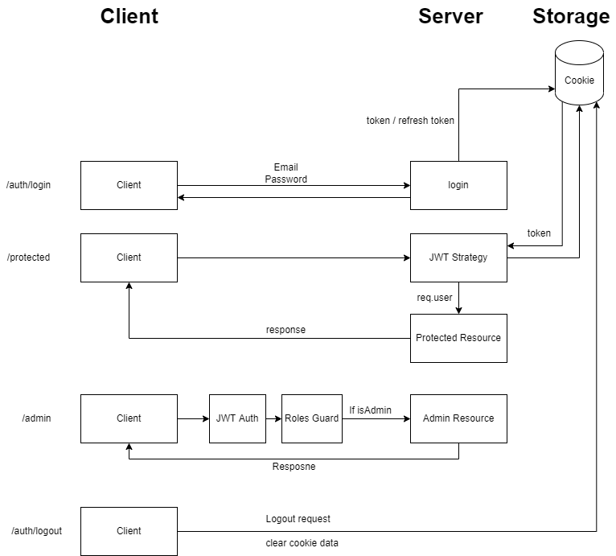

<p align="center">
  <a href="http://nestjs.com/" target="blank"></a>
</p>

## Description

Authentication system built with Passportjs.

## Requirements

- Nodejs
- MongoDB Local or MongoDB Atlas

## Installation

```bash
npm install
```

## How to run the app

1. Clone the repo locally (should have git installed locally)

`$ git clone <https://github.com/menaaziz27/auth-task.git>`

2. edit your mongodb connection string `src/app.module.ts` line 10.

3. run any of the following ..

### development

$ npm run start

### watch mode

$ npm run start:dev

### production mode

$ npm run start:prod

## My Thniking & Design Process

- As mentioned in the task, Clean code was expected since that I had to use NestJS Framework to make the code readable and more safety.

- I started to split my services to its own and abstracted the logic from the controllers

- Firstly, I focused to make the job done and lastly I started to refactor and re-structure.

- Since the task was a RESTful API, I used passportjs with jwt strategy to authenticate the user.

<br>

## Authentication System Workflow

<br>
<br>
<p align="center">

</p>
<br>

## What I learned

- I learnt alot abot NestJS since I used to use ExpressJS.

- I realized that I could write softwares from only a documentation.

- I've learnt how to create custom roles and custom auth guards in NestJS.

- How to add and manage roles and expect specific values rom the user.

<br>

## The Api endpoints

```
/auth/register => signup

/auth/login          => login

/auth/refresh-tokens => refresh tokens

/auth/logout         => log user out (clear cookies)

/                    => protected route

/public              => public route

/admin               => require authentication and admin role only

/users               => require authentication and user role only
```

<br>

## Notes

- There's no test included however I've included validation and useful errors as a response.
- I know I should use environment variables but I've consumed a little bit of my time to use them in NestJs so I left the DB strings and jwt secrets available since it's a simple task and not gonna be in the production.

## Useful Links

[article](https://javascript.plainenglish.io/nestjs-implementing-access-refresh-token-jwt-authentication-97a39e448007)

[NestJS Docs](https://docs.nestjs.com/)
